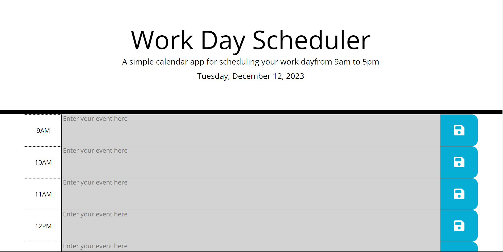

# Daily Planner

## Description

A simple and intuitive calendar app for scheduling your work day. This web-based scheduler allows users to view and manage their daily tasks within standard business hours. It features dynamically updated HTML and CSS powered by jQuery and utilizes the Day.js library for handling date and time functionalities.

The application is created to satisfy the folloing conditions:

-  Display the current day at the top of the calendar when a user opens the planner.

-  Present timeblocks for standard business hours when the user scrolls down.

-  Color-code each timeblock based on past, present, and future when the timeblock is viewed.

-  Allow a user to enter an event when they click a timeblock.

-  Save the event in local storage when the save button is clicked in that timeblock.

-  Persist events between refreshes of a page.

Home Page of the Daily Planner App.

## Credits

The following articles and websites are used as references for this particular project.

[Professional README Guide](https://coding-boot-camp.github.io/full-stack/github/professional-readme-guide)

[JavaScript Objects](https://developer.mozilla.org/en-US/docs/Web/JavaScript/Reference/Global_Objects/Object)

[JQuery](https://jquery.com/)

[Day.js Library](https://day.js.org/docs/en/display/format)

## Deployment Page Link

[Daily Planner](https://anjalsali.github.io/Daily-Planner/)
